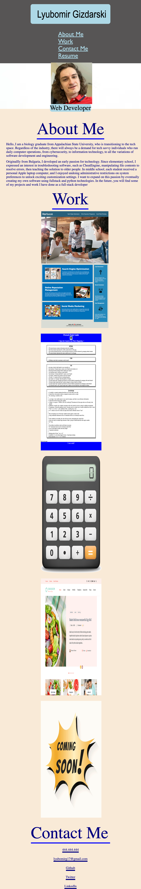

# Lyubomir's Portfolio

## Description

A sample portfolio website of my experience as a full-stack developer for prospective employers. More projects will be added soon to replace placeholder images.

## Usage

You can access the website here: https://lyubomirg1995.github.io/lyubomir-portfolio/

## Credits

Image stacking methods and alignment: AskBCS Learning Assistant, skaliaperumal

Media queries: Sean McCarthy

Background image attribution:  "https://www.freepik.com/free-photo/creative-flat-lay-photo-workspace-desk_3520026.htm#query=work%20background&position=7&from_view=keyword&track=ais
    -Image by tirachardz

Portfolio structure: Santi Palacios (Teacher's Assistant)

Header and figure HTML code: starter code from horiseon-marketing repo on my account
